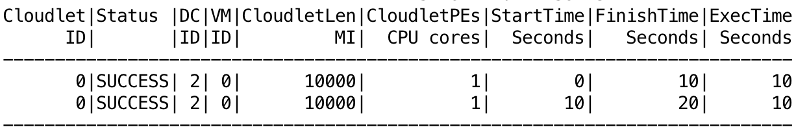

# Master Thesis

<a id="top"></a>

<p align="center">
<b><a href="#overview">Overview</a></b>
|
<b><a href="#how-to-use-cloudsim-plus">How to use</a></b>
|
<b><a href="#a-minimal-simulation-example">Example</a></b>
|
<b><a href="#documentation-and-help">Docs and Help</a></b>
|
<b><a href="#publications">Publications of CloudSim</a></b>
|
<b><a href="#license">License</a></b>
|
<b><a href="#contributing">Contribution Guide</a></b>
</p>

[](https://travis-ci.org/gmartinezramirez/Master-Thesis-Code) [](https://www.codacy.com/app/gonzalo-martinez-ra/Master-Thesis-Code?utm_source=github.com&amp;utm_medium=referral&amp;utm_content=gmartinezramirez/Master-Thesis-Code&amp;utm_campaign=Badge_Grade)

# Overview

Repository for master thesis of scheduling in fog computing.

This project uses CloudSim Plus and acts like a extension of that.

CloudSim Plus is an extensible simulation framework that enables modeling, simulation, and experimentation of emerging Cloud computing infrastructures and application services, allowing its users to focus on specific system design issues that they want to investigate,  without getting concerned about the low level details related to Cloud-based infrastructures and services.
 
CloudSim Plus is a fork of [CloudSim 3](https://github.com/Cloudslab/cloudsim/tree/20a7a55e537181489fcb9a2d42a3e539db6c0318) 
that was re-engineered primarily to avoid code duplication for improved [code reusability](https://en.wikipedia.org/wiki/Code_reuse)
and to ensure compliance with software engineering principles and recommendations, aiming to provide a more extensible, 
less [coupled](https://en.wikipedia.org/wiki/Coupling_(computer_programming)), 
more [cohesive](https://en.wikipedia.org/wiki/Cohesion_(computer_science)) cloud simulation framework.  

It focuses on usage of software engineering standards and recommendations 
such as [Design Patterns](https://en.wikipedia.org/wiki/Software_design_pattern), 
[SOLID principles](https://en.wikipedia.org/wiki/SOLID_(object-oriented_design)) 
and other ones such as [KISS](https://en.wikipedia.org/wiki/KISS_principle) 
and [DRY](https://pt.wikipedia.org/wiki/Don't_repeat_yourself).

The original CloudSim project is developed in [the Cloud Computing and Distributed Systems (CLOUDS) Laboratory](http://cloudbus.org/), 
at [the Computer Science and Software Engineering Department](http://www.csse.unimelb.edu.au/) of [the University of Melbourne](http://www.unimelb.edu.au/).

<p align="right"><a href="#top">:arrow_up:</a></p>

# How to use CloudSim Plus 
CloudSim Plus is a Maven project with some modules. The easier way to use the project is relying on some IDE such as NetBeans, Eclipse or IntelliJ IDEA. 
Accordingly, you can just check the gif below or see the complete instructions in the next sub-sections.


There is a high quality video version of this gif available in [YouTube](https://youtu.be/hvFJtvrkCNI).

But if you are such a "terminal person", the sub-section below shows the instructions.

## By means of command line (if you don't like or don't want to use an IDE)
Considering that you have [git](https://git-scm.com) and [maven](http://maven.apache.org) installed on your operating system, 
download the project source by cloning the repositosy using the command `git clone https://github.com/manoelcampos/cloudsim-plus.git` 
at a terminal. 

The project has a [bash script](script/bootstrap.sh) that you can use to build and run CloudSim Plus examples. 
The script must be run on the project root directory in a Unix-like system such as Linux, FreeBDS and Mac OSX.

To run some example type the command: `sh script/bootstrap.sh ExampleClassName`.
For instance, to run the CloudSimExample1 you can type: `sh script/bootstrap.sh CloudSimExample1`. 
To run an example into a sub-directory, type `sh script/bootstrap.sh sub_directory_name.ExampleClassName`.
For instance, to run the [workload/SwfWorkloadFormatExample1](/cloudsim-plus-examples/src/main/java/org/cloudbus/cloudsim/examples/workload/SwfWorkloadFormatExample1.java) 
example, type `sh script/bootstrap.sh workload.SwfWorkloadFormatExample1`.

The script checks if it is required to build the project, using maven in this case, making sure to download all dependencies. 
To see what examples are available, just navigate through the [examples directory](/cloudsim-plus-examples/src/main/java/org/cloudbus/cloudsim/examples).

To just build the CloudSim Plus and examples packages, execute the script without any parameter.  
 
## By means of an IDE (the easier way to just take a look or to create your own simulations)
The easier way to use the project is relying on some IDE such as [NetBeans](http://netbeans.org), [Eclipse](http://eclipse.org) 
or [IntelliJ IDEA](http://jetbrains.com/idea/).
Below are the steps to start using the project:

- Download the project sources using the download button on top of this page or clone it using `git clone https://github.com/manoelcampos/cloudsim-plus.git` 
at a terminal.
- Open/import the project in your IDE:
    - For NetBeans, just use the "Open project" menu and select the directory where the project was downloaded/cloned.
    - For Eclipse or IntelliJ IDEA, 
      you have to import the project selecting the folder where the project was cloned. 
- Inside the opened/imported project you will have the cloudsim-plus and cloudsim-plus-examples modules. 
  The cloudsim-plus module is where the simulator source code is, that usually you don't have to change, unless you want to contribute to the project. 
  The cloudsim-plus-examples is where you can start.
- Open the cloudsim-plus-examples module. The most basic examples are in the root of the org.cloudbus.cloudsim.examples package. 
  You can run any one of the classes in this package to get a specific example. 
- If you want to build your own simulations, the easiest way is to create another class inside this module.

<p align="right"><a href="#top">:arrow_up:</a></p>

# A minimal simulation example

The construction of a scenario to simulate the infrastructure of a Cloud provider is not so minimal. 
In order to build such a simulation you have to create, at least: 
- a datacenter with a list of physical machines (Hosts); 
- a broker that allows submission of VMs and Cloudlets to be executed, on behalf of a given customer, into the cloud infrastructure; 
- a list of customer's virtual machines (VMs); 
- and a list of customer's cloudlets (objects that model resource requirements of different applications).

By this way, the main code used to build such a simulation scenario can be as below. 
This is simply the code of the constructor method. 
The complete example is available at the cloudsim-plus-examples module 
[here](/cloudsim-plus-examples/src/main/java/org/cloudbus/cloudsim/examples/MinimalExample.java).

```java
this.vmList = new ArrayList<>();
this.cloudletList = new ArrayList<>();
//Number of cloud customers
int numberOfCloudUsers = 1; 
boolean traceEvents = false;

CloudSim.init(numberOfCloudUsers, Calendar.getInstance(), traceEvents);

Datacenter datacenter0 = createDatacenter("Datacenter0");

/*Creates a Broker accountable for submission of VMs and Cloudlets
on behalf of a given cloud user (customer).*/
DatacenterBroker broker0 = new DatacenterBrokerSimple("Broker0");

Vm vm0 = createVm(broker0);
this.vmList.add(vm0);
broker0.submitVmList(vmList);

/*Creates a cloudlet that represents an application to be run inside a VM.*/
Cloudlet cloudlet0 = createCloudlet(broker0, vm0);
this.cloudletList.add(cloudlet0);
broker0.submitCloudletList(cloudletList);

/*Starts the simulation and waits all cloudlets to be executed*/
CloudSim.startSimulation();

//Finishes the simulation
CloudSim.stopSimulation();

/*Prints results when the simulation is over
(you can use your own code here to print what you want from this cloudlet list)*/
List<Cloudlet> finishedCloudlets = broker0.getCloudletsFinishedList();
CloudletsTableBuilderHelper.print(new TextTableBuilder(), finishedCloudlets);
Log.printFormattedLine("Minimal Example finished!");
```

And the results are more structured and clear, including the unit of some presented data, in order to allow better understanding. 
The image below, for a simulation with two cloudlets (applications) gives you a preview. 


<p align="right"><a href="#top">:arrow_up:</a></p>

# Documentation and Help
The project documentation originated from CloudSim was entirely updated and extended. 
You can see the javadoc documentation for classes and their elements directly on your IDE.

The documentation is available online at <http://cloudsimplus.org/docs/>.
There is also a [Wiki page](https://github.com/manoelcampos/cloudsim-plus/wiki) with additional information such as a FAQ list.  

A Google Group forum is also available at <https://groups.google.com/d/forum/cloudsim-plus>

<p align="right"><a href="#top">:arrow_up:</a></p>

<a id="publications"></a>
# Publications about the original CloudSim version

  * Anton Beloglazov, and Rajkumar Buyya, [Optimal Online Deterministic Algorithms and Adaptive Heuristics for Energy and Performance Efficient Dynamic Consolidation of Virtual Machines in Cloud Data Centers](http://beloglazov.info/papers/2012-optimal-algorithms-ccpe.pdf), Concurrency and Computation: Practice and Experience, Volume 24, Number 13, Pages: 1397-1420, John Wiley & Sons, Ltd, New York, USA, 2012.
  * Saurabh Kumar Garg and Rajkumar Buyya, [NetworkCloudSim: Modelling Parallel Applications in Cloud Simulations](http://www.cloudbus.org/papers/NetworkCloudSim2011.pdf), Proceedings of the 4th IEEE/ACM International Conference on Utility and Cloud Computing (UCC 2011, IEEE CS Press, USA), Melbourne, Australia, December 5-7, 2011.
  * **Rodrigo N. Calheiros, Rajiv Ranjan, Anton Beloglazov, Cesar A. F. De Rose, and Rajkumar Buyya, [CloudSim: A Toolkit for Modeling and Simulation of Cloud Computing Environments and Evaluation of Resource Provisioning Algorithms](http://www.buyya.com/papers/CloudSim2010.pdf), Software: Practice and Experience (SPE), Volume 41, Number 1, Pages: 23-50, ISSN: 0038-0644, Wiley Press, New York, USA, January, 2011. (Preferred reference for CloudSim)**
  * Bhathiya Wickremasinghe, Rodrigo N. Calheiros, Rajkumar Buyya, [CloudAnalyst: A CloudSim-based Visual Modeller for Analysing Cloud Computing Environments and Applications](http://www.cloudbus.org/papers/CloudAnalyst-AINA2010.pdf), Proceedings of the 24th International Conference on Advanced Information Networking and Applications (AINA 2010), Perth, Australia, April 20-23, 2010.
  * Rajkumar Buyya, Rajiv Ranjan and Rodrigo N. Calheiros, [Modeling and Simulation of Scalable Cloud Computing Environments and the CloudSim Toolkit: Challenges and Opportunities](http://www.cloudbus.org/papers/CloudSim-HPCS2009.pdf), Proceedings of the 7th High Performance Computing and Simulation Conference (HPCS 2009, ISBN: 978-1-4244-4907-1, IEEE Press, New York, USA), Leipzig, Germany, June 21-24, 2009.
  
<p align="right"><a href="#top">:arrow_up:</a></p>
  
# License

This project is licensed under [GNU GPLv3](http://www.gnu.org/licenses/gpl-3.0), as defined in CloudSim 3 source codes.

<p align="right"><a href="#top">:arrow_up:</a></p>

# Contributing

If you desire to contribute to the project, you are welcome. However, make sure to read the [contribution guide](CONTRIBUTING.md) before you start.

<p align="right"><a href="#top">:arrow_up:</a></p>
